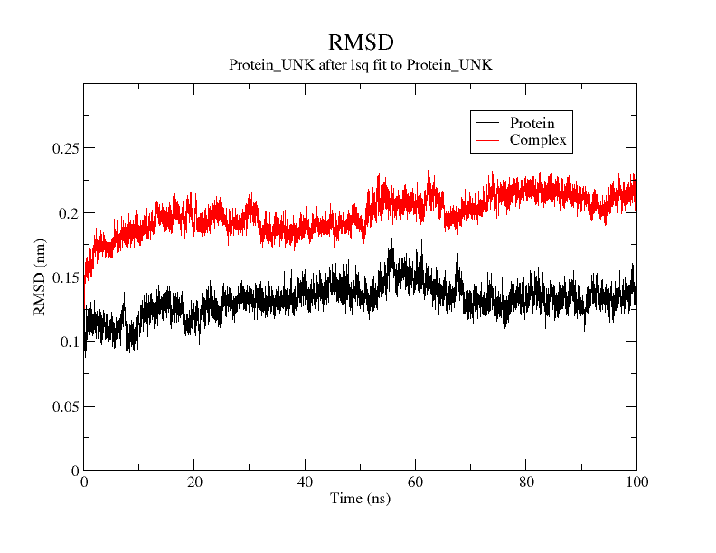
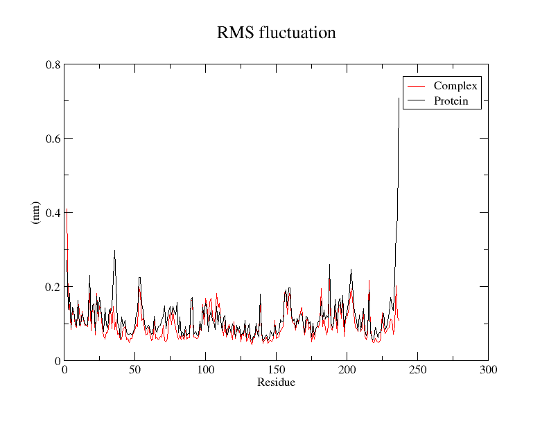
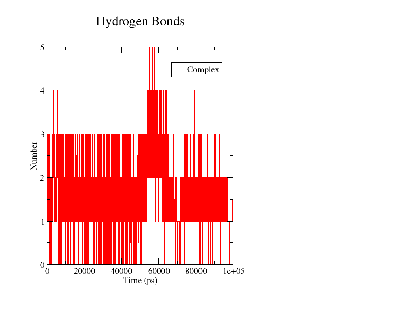

# Structural Biology & Computational Drug Discovery Workflow

## Project Overview
An end-to-end computational drug discovery pipeline targeting bacterial proteins. This project integrates virtual screening, molecular docking, and long-trajectory molecular dynamics (MD) simulations to evaluate binding affinities and complex stability.

## Virtual screening 
Screened 2,854 compounds from DrugBank against PrfA using AutoDock; hydromorphone (referred to as UNK in trajectory files) was selected as the lead compound for MD validation based on binding affinity

## Molecular Dynamics Results (100 ns Trajectory)
### 1. Backbone RMSD Profile

- **Backbone Stability:** The standalone protein backbone equilibrated rapidly and maintained structural stability around **~0.13 nm (1.3 Å)** across 100 ns.
- **Complex Dynamics:** The protein-ligand complex plateaued around **~0.21 nm (2.1 Å)**, reflecting minor conformational adaptation of the binding site loop regions to accommodate the ligand (UNK) while maintaining a highly stable bound state throughout the simulation.

### 2. Residue Flexibility (RMSF)

- Maintained low fluctuations (< 0.2 nm) across major secondary structural elements, with expected terminal flexibility reduced upon ligand binding.

### 3. Intermolecular Hydrogen Bonding

- Consistent formation of 1–3 hydrogen bonds across the entire 100 ns trajectory, confirming persistent active-site interactions.

## Trajectory Analysis Commands
```bash
# Trajectory PBC Handling & Metric Extractions
gmx trjconv -s md.tpr -f md.xtc -o md_noPBC.xtc -pbc mol -center
gmx rms -s md.tpr -f md_noPBC.xtc -n index_ligand_UNK.ndx -o rmsd_final.xvg -tu ns
gmx rmspf -s md.tpr -f md_noPBC.xtc -n index_ligand_UNK.ndx -o rmsf_final.xvg -res
gmx hbond -s md.tpr -f md_noPBC.xtc -n index_ligand_UNK.ndx -num Hbond.xvg
